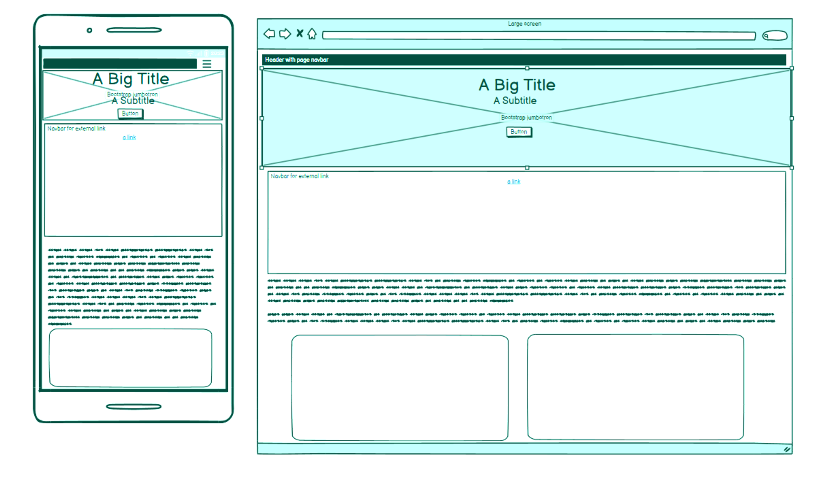
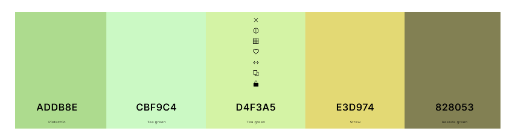
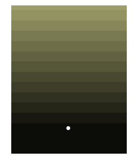
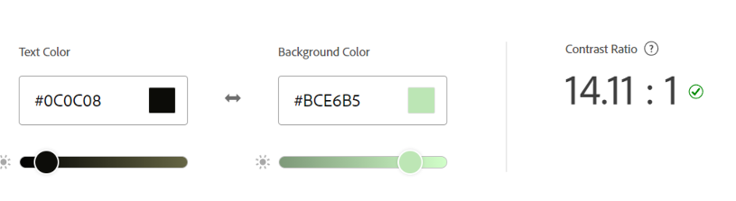

# Primary Focus 
##  Mental Health Awareness Project

Design, creation and deployment of a static Front-End single page website using both HTML and CSS with Bootstrap, engaging with the principles of user experience, accessibility, and device responsivity. The content will include information on mental health awareness, companion resources, and links where applicable. I intend th site to highlight above all the access to resorces, and to encourage visitors to reach out.

## User Narrative

The user seeks accessible, beginner-friendly information and advice on mental health, including how to acknowledge shared issues, and manage anxiety or depression, related to these issues. Content shoul be presented in a supportive and organised layout.

The visitors will have access to a safe informational space with a webpage which is both calming and inviting, as well as intuitive to use. The encouragement of calls to action, supportive quotes and images will be included.

The page is designed to be responsive in allowing visitors to access it from a range of devices, in both portrait and landscape formats.

## Initial site visitor experience

    • Inclusion of a navigation bar to guide a new user to a variety of page sections.
    • A hero image portraying serenity
    • A section devoted to both helpful and crisis management resources

## Returning visitor experience

Easy access to important resource links

## Creation Process

### Strategy

    The page must be accessible on a wide range of devices due to the expected varied demographic. The text must be of an informal and attractive style, yet with a sense of respectability. Reading is an activity,  and readability refers to qualities of a text that make reading easier. Helping a reader to easily engage with a message while at a challenging moment in either their own life, or that of a loved one or associate is important. Poor readability can convince any reader to disengage with subject matter rapidly.

### Scope

The page must be accessible on a wide range of devices due to the expected varied demographic. The text must be of an informal and attractive style, yet with a sense of respectability. Reading is an activity, and readability refers to qualities of a text that make reading easier. Helping a reader to easily engage with a message while at a challenging moment in either their own life, or that of a loved one or associate is important. Poor readability can convince any reader to disengage with subject matter rapidly.

### Structural

      Functional and intuitive navigation with engaging interactivity were imperative.
      Easily identifiable call to action elements.
      Supportive quotes with dynamic mouse hover changes, signifying change.
      A Bootstrap Jumbotron with encouraging messaging.
      Bootstrap card components to present mental health issues and proactive advice, resource Links.
      A grid layout for external links to mental health resources, styled with Bootstrap buttons to draw the viewer’s attention.
      Use of Bootstrap text utilities to include a section with uplifting quotes or messages to encourage users to engage.

### Skeleton

The site was developed to be simple, clear, and familiar.
A heading navbar to be visible at all times despite scrolling
A footer with social media links to be visible at all times despite scrolling
The simple, three-item navigation bar of 'Home', 'Menu', and 'Contact', is situated always to the right of the logo. An underline feature identifying the current page and whether a cursor or touch was accurate.
A large hero image dominating the top section of the page.
I decided to opt for Google font Lexend, as it has the asset of being one of the more accessible fonts for those with dyslexia, and looks informal without being child-like.

### Surface

      The final stage, concerned with the users’ sensory experience. Colours and textures employed in the visual design to aid page navigation and interactivity. Also how presentation of content draws the eye to key information. 
 

## Wireframe

## Design

### Initial Colour Scheme

Colour therapy was an important consideration. Cool and pastel shades of blue and green are known to have a soothing effect on mind and body, reducing feelings of stress and anxiety, so the design entailed utilising pastel tones synonymous with nature peaceful online visual environment with pastel tones synonymous with nature. Green in particular is efficacious in reducing anxiety, and promoting stress release. 

I initially used Coolors https://coolors.co/addb8e-cbf9c4-d4f3a5-e3d974-828053 to generate a soothing colour pallette, but which included a deeper but soft shade of olive green to provide some page contrast in call to action buttons.

I used the generator to access a range of deeper shades for the text to provide accessible and readable contrast. I opted for a deep but smoky black.

To ensure accessibility I used Adobe Color Contrast checker to input colours before starting the project to at least hit the ground running. I decided to change what was to be my main background colour to increase the contrast ratio to a very high level.

https://color.adobe.com/create/color-contrast-analyzer

### End Colour Scheme

### Typography

I decided to opt for Google font Lexend, as it has the asset of being one of the more accessible fonts for those with dyslexia, and looks informal without being child-like.

**Imagery**

**Page Features**

**Tablet & Mobile View**

**Technologies Used**

**Deployment**

**Testing**

**Performance**

**Bugs & Fixes**

**Unsolved Bugs**

**Credits**

**Content References**

**Media References**

**Acknowledgements**
